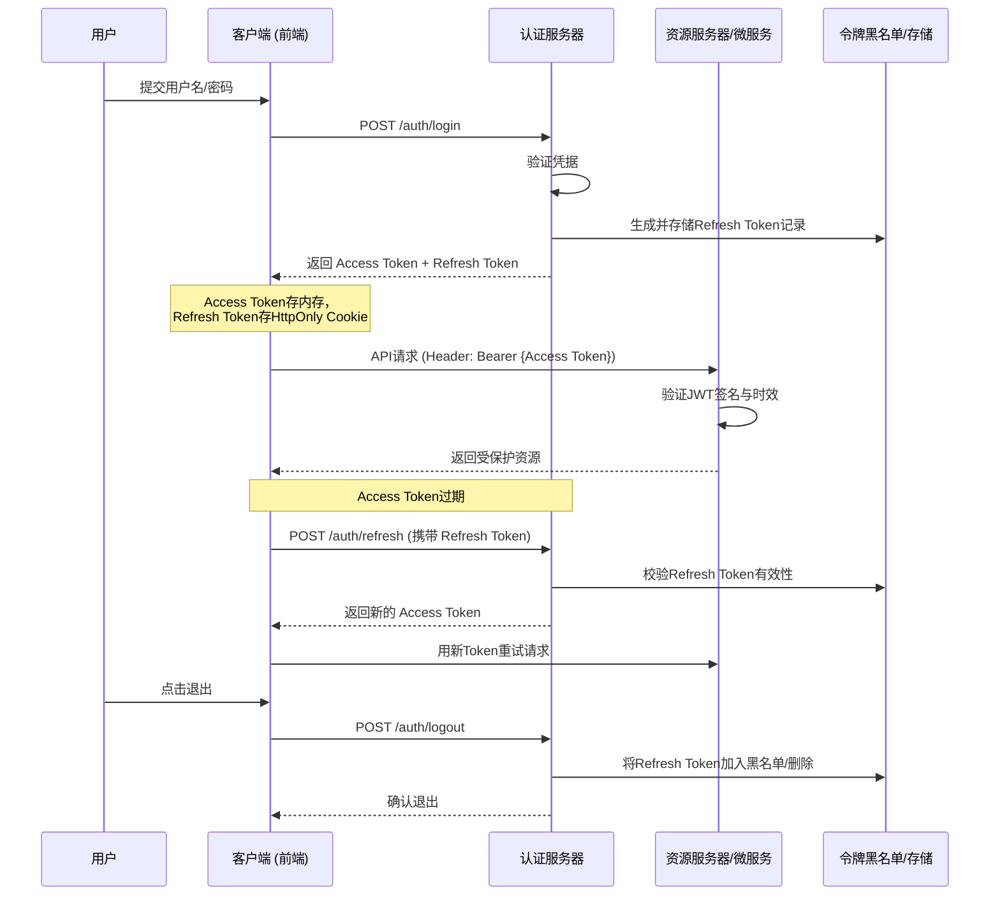

登录与认证流程

```mermaid

sequenceDiagram
    participant U as 用户
    participant C as 客户端 (前端)
    participant AS as 认证服务器
    participant RS as 资源服务器/微服务
    participant DB as 令牌黑名单/存储

    U->>C: 提交用户名/密码
    C->>AS: POST /auth/login
    AS->>AS: 验证凭据
    AS->>DB: 生成并存储Refresh Token记录
    AS-->>C: 返回 Access Token + Refresh Token
    Note over C: Access Token存内存，<br>Refresh Token存HttpOnly Cookie

    C->>RS: API请求 (Header: Bearer {Access Token})
    RS->>RS: 验证JWT签名与时效
    RS-->>C: 返回受保护资源

    Note over C,AS: Access Token过期
    C->>AS: POST /auth/refresh (携带 Refresh Token)
    AS->>DB: 校验Refresh Token有效性
    AS-->>C: 返回新的 Access Token
    C->>RS: 用新Token重试请求

    U->>C: 点击退出
    C->>AS: POST /auth/logout
    AS->>DB: 将Refresh Token加入黑名单/删除
    AS-->>C: 确认退出


```